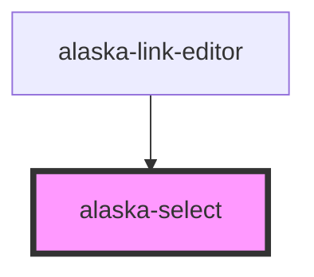

# alaska-select

<!-- Auto Generated Below -->

## Properties

| Property  | Attribute | Description | Type             | Default |
| --------- | --------- | ----------- | ---------------- | ------- |
| `options` | --        |             | `SelectOption[]` | `[]`    |

## Dependencies

### Used by

 - [alaska-link-editor](..\..\editors\link-editor)

### Graph

----------------------------------------------

*Built with [StencilJS](https://stenciljs.com/)*
