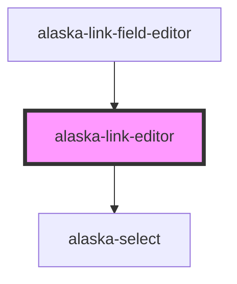

# alaska-link-editor

<!-- Auto Generated Below -->

## Properties

| Property   | Attribute | Description | Type            | Default     |
| ---------- | --------- | ----------- | --------------- | ----------- |
| `linkData` | --        |             | `LinkFieldData` | `undefined` |

## Dependencies

### Used by

 - [alaska-link-field-editor](..\..\fields\link-field-editor)

### Depends on

- [alaska-select](..\..\controls\select)

### Graph

----------------------------------------------

*Built with [StencilJS](https://stenciljs.com/)*
