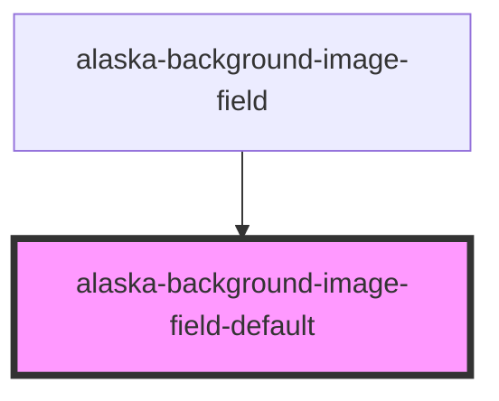

# alaska-background-image-field-default

<!-- Auto Generated Below -->

## Properties

| Property          | Attribute       | Description | Type                           | Default     |
| ----------------- | --------------- | ----------- | ------------------------------ | ----------- |
| `backgroundStyle` | --              |             | `{ [key: string]: string; }`   | `undefined` |
| `field`           | --              |             | `ContentField<ImageFieldData>` | `undefined` |
| `innerContent`    | `inner-content` |             | `string`                       | `undefined` |
| `version`         | `version`       |             | `string`                       | `undefined` |

## Dependencies

### Used by

 - [alaska-background-image-field](..\background-image-field)

### Graph

----------------------------------------------

*Built with [StencilJS](https://stenciljs.com/)*
