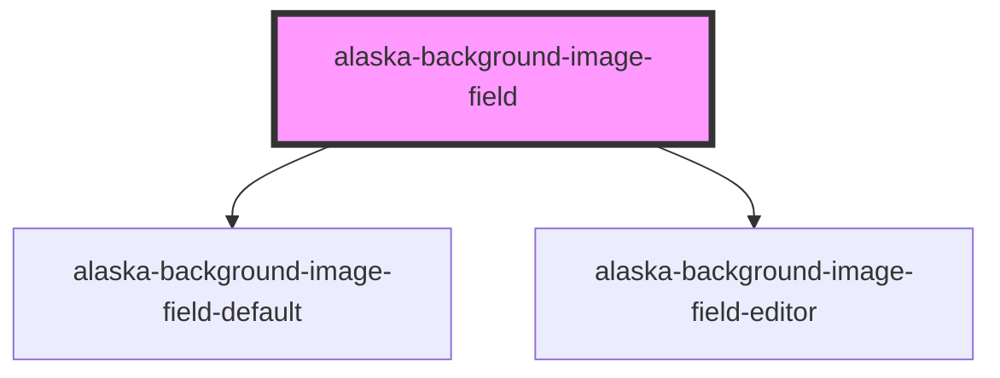

# alaska-background-image-field

<!-- Auto Generated Below -->

## Properties

| Property   | Attribute  | Description | Type                           | Default     |
| ---------- | ---------- | ----------- | ------------------------------ | ----------- |
| `field`    | --         |             | `ContentField<ImageFieldData>` | `undefined` |
| `height`   | `height`   |             | `string`                       | `'100%'`    |
| `position` | `position` |             | `string`                       | `'center'`  |
| `repeat`   | `repeat`   |             | `boolean`                      | `false`     |
| `size`     | `size`     |             | `string`                       | `'cover'`   |
| `width`    | `width`    |             | `string`                       | `'100%'`    |

## Events

| Event  | Description | Type               |
| ------ | ----------- | ------------------ |
| `edit` |             | `CustomEvent<any>` |

## Methods

### `refresh() => Promise<void>`

#### Returns

Type: `Promise<void>`

### `setField(field: ContentField<ImageFieldData>) => Promise<void>`

#### Returns

Type: `Promise<void>`

### `setMode(mode: ContentMode) => Promise<void>`

#### Returns

Type: `Promise<void>`

## Dependencies

### Depends on

- [alaska-background-image-field-default](..\background-image-field-default)
- [alaska-background-image-field-editor](..\background-image-field-editor)

### Graph

----------------------------------------------

*Built with [StencilJS](https://stenciljs.com/)*
