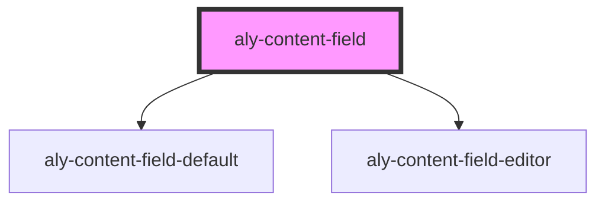

# aly-content-field

<!-- Auto Generated Below -->

## Methods

### `setField(field: ContentField<any>) => Promise<void>`

#### Returns

Type: `Promise<void>`

### `setMode(mode: ContentMode) => Promise<void>`

#### Returns

Type: `Promise<void>`

## Dependencies

### Depends on

- [aly-content-field-default](..\content-field-default)
- [aly-content-field-editor](..\content-field-editor)

### Graph

----------------------------------------------

*Built with [StencilJS](https://stenciljs.com/)*
