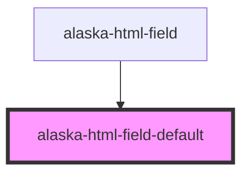

# aly-html-field

<!-- Auto Generated Below -->

## Properties

| Property | Attribute | Description | Type                   | Default     |
| -------- | --------- | ----------- | ---------------------- | ----------- |
| `field`  | --        |             | `ContentField<string>` | `undefined` |

## Dependencies

### Used by

 - [alaska-html-field](..\html-field)

### Graph

----------------------------------------------

*Built with [StencilJS](https://stenciljs.com/)*
