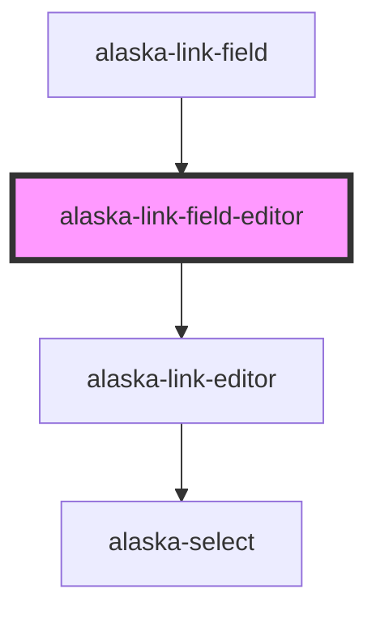

# aly-link-field-editor

<!-- Auto Generated Below -->

## Properties

| Property | Attribute | Description | Type                          | Default     |
| -------- | --------- | ----------- | ----------------------------- | ----------- |
| `field`  | --        |             | `ContentField<LinkFieldData>` | `undefined` |

## Events

| Event  | Description | Type               |
| ------ | ----------- | ------------------ |
| `edit` |             | `CustomEvent<any>` |

## Dependencies

### Used by

 - [alaska-link-field](..\link-field)

### Depends on

- [alaska-link-editor](..\..\editors\link-editor)

### Graph

----------------------------------------------

*Built with [StencilJS](https://stenciljs.com/)*
