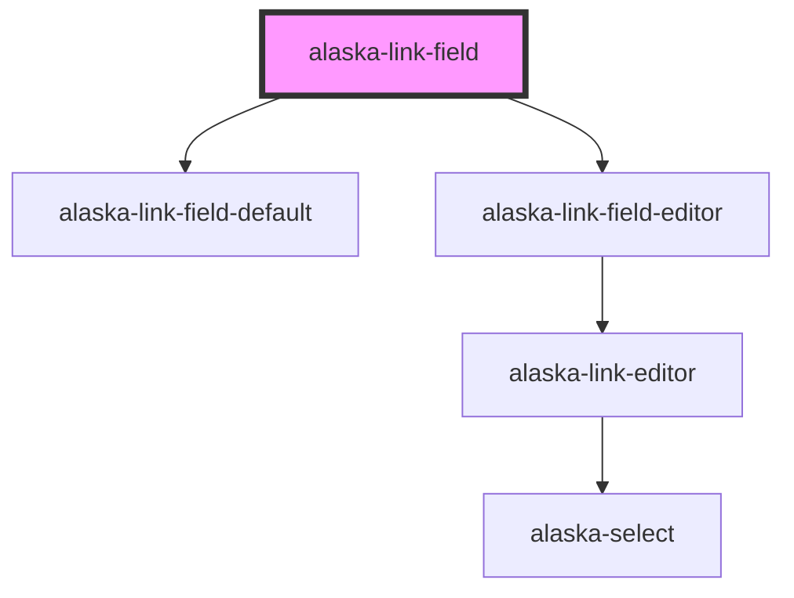

# aly-link-field

<!-- Auto Generated Below -->

## Properties

| Property | Attribute | Description | Type                          | Default     |
| -------- | --------- | ----------- | ----------------------------- | ----------- |
| `field`  | --        |             | `ContentField<LinkFieldData>` | `undefined` |

## Methods

### `setField(field: ContentField<LinkFieldData>) => Promise<void>`

#### Returns

Type: `Promise<void>`

### `setMode(mode: ContentMode) => Promise<void>`

#### Returns

Type: `Promise<void>`

## Dependencies

### Depends on

- [alaska-link-field-default](..\link-field-default)
- [alaska-link-field-editor](..\link-field-editor)

### Graph

----------------------------------------------

*Built with [StencilJS](https://stenciljs.com/)*
