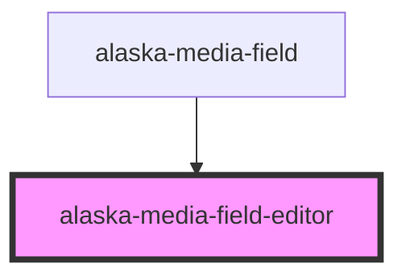

# aly-image-field-editor

<!-- Auto Generated Below -->

## Properties

| Property  | Attribute | Description | Type                           | Default     |
| --------- | --------- | ----------- | ------------------------------ | ----------- |
| `field`   | --        |             | `ContentField<MediaFieldData>` | `undefined` |
| `version` | `version` |             | `string`                       | `undefined` |

## Events

| Event          | Description | Type               |
| -------------- | ----------- | ------------------ |
| `edit`         |             | `CustomEvent<any>` |
| `stateChanged` |             | `CustomEvent<any>` |

## Dependencies

### Used by

 - [alaska-media-field](..\media-field)

### Graph

----------------------------------------------

*Built with [StencilJS](https://stenciljs.com/)*
