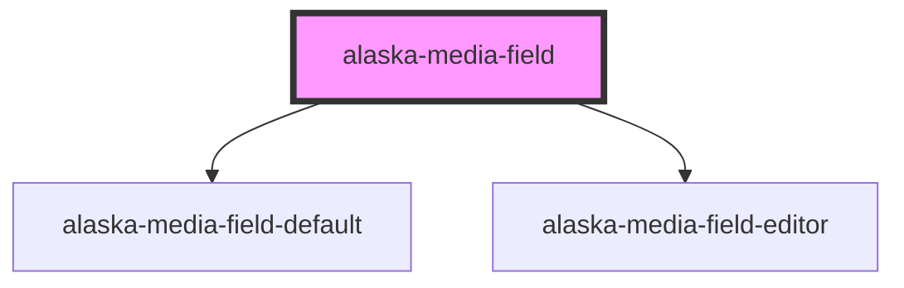

# aly-image-field

<!-- Auto Generated Below -->

## Properties

| Property | Attribute | Description | Type                           | Default     |
| -------- | --------- | ----------- | ------------------------------ | ----------- |
| `field`  | --        |             | `ContentField<MediaFieldData>` | `undefined` |

## Events

| Event          | Description | Type               |
| -------------- | ----------- | ------------------ |
| `edit`         |             | `CustomEvent<any>` |
| `stateChanged` |             | `CustomEvent<any>` |

## Methods

### `refresh() => Promise<void>`

#### Returns

Type: `Promise<void>`

### `setField(field: ContentField<MediaFieldData>) => Promise<void>`

#### Returns

Type: `Promise<void>`

### `setMode(mode: ContentMode) => Promise<void>`

#### Returns

Type: `Promise<void>`

## Dependencies

### Depends on

- [alaska-media-field-default](..\media-field-default)
- [alaska-media-field-editor](..\media-field-editor)

### Graph

----------------------------------------------

*Built with [StencilJS](https://stenciljs.com/)*
